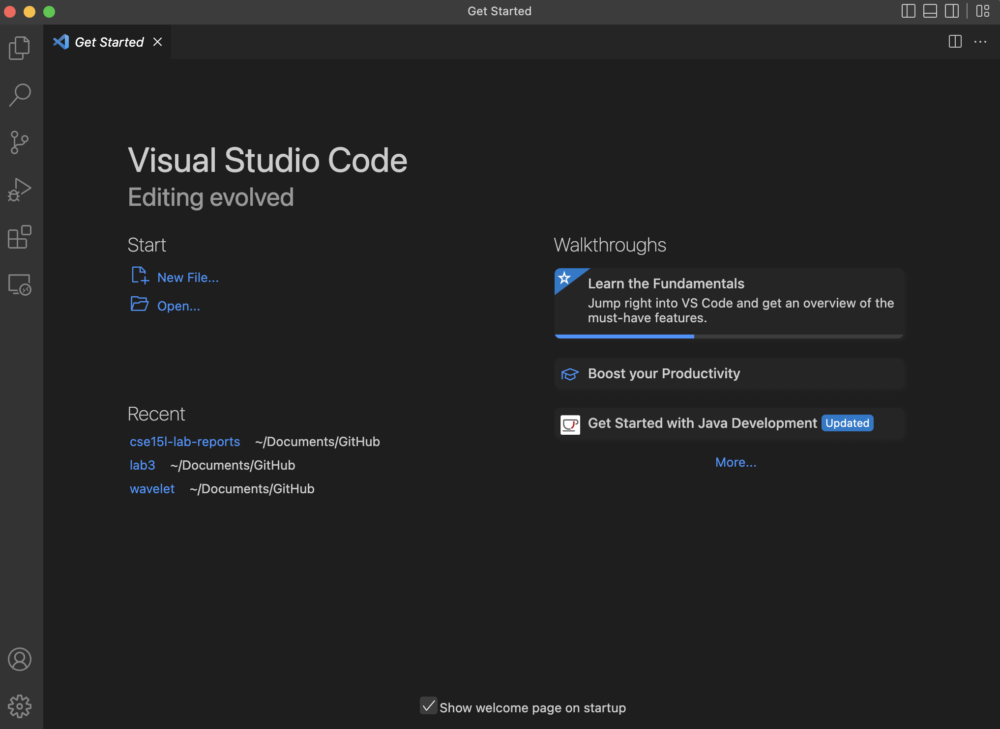
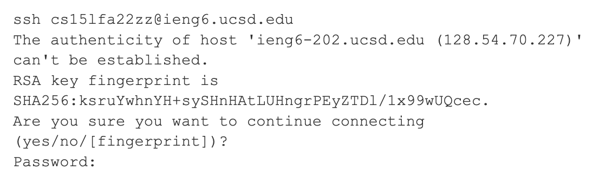
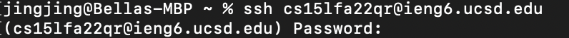
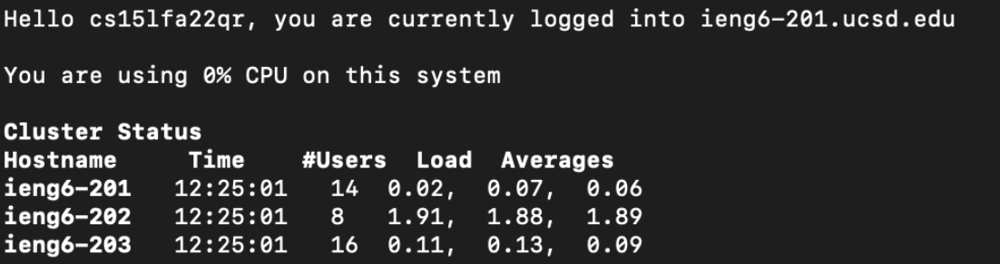
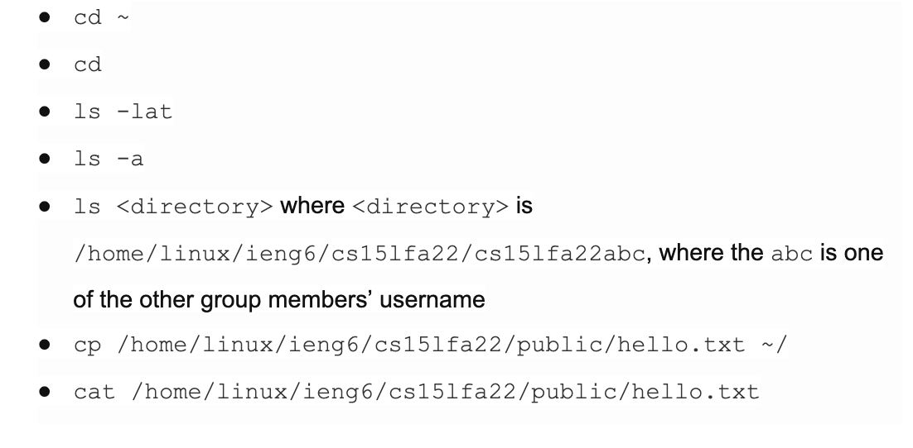
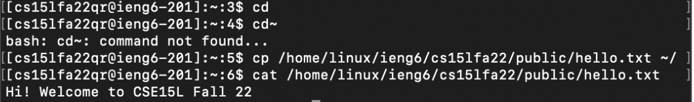
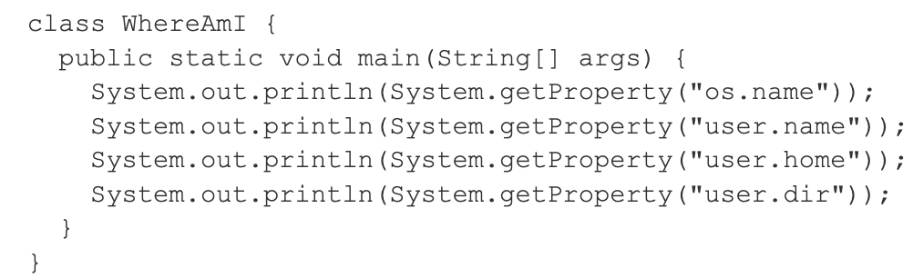
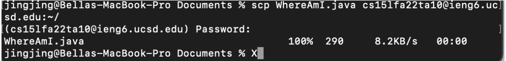
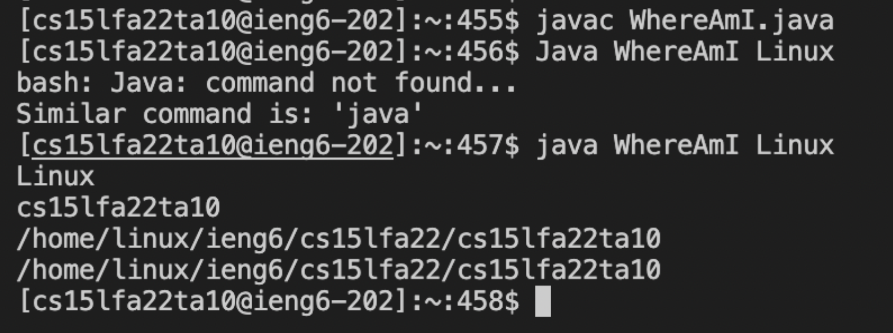

# Lab 1 report

To Install the code,go to this website: https://code.visualstudio.com/.

The above picture shows what the page looks like when you open the application.

-Remotely Connecting

For macs users, open a terminal in VSCode 
Type in the command below with your course-specific account:

$ ssh cs15lfa22zz@ieng6.ucsd.edu

(the letters zz should be replaced by your letters in course-specific account)

This is the information that you might see when you remotely connect for the first time. By typing yes, you will give your password for the specific account that you set for. Below is an image that you should see after the first time.

-Run Commands
At this time, try to use some commands like 

Above is the result from a few of these commands.
Besides logging in, it is important to log out of the remote server in the terminal by using (Ctrl-D) or (Run the command exit).

-Moving Files with scp command 

First is to create a file called WhereAmI.java with the following contents.

In the terminal from the directory where you made this file, run the following command with your own username.

scp WhereAmI.java cs15lfa22zz@ieng6.ucsd.edu:~/

There should be a password option and you can type in your own password. Then you should get something like the picture below.

Then log into ieng6 with ssh again. With the below commands, you should be able to see the file in your home directory.(remote server)

javac WhereAmI.java

java WhereAmI

(be careful with the case requirement for the commands)

-Setting an SSH keys

On client, which is your computer, you should type in the command below

