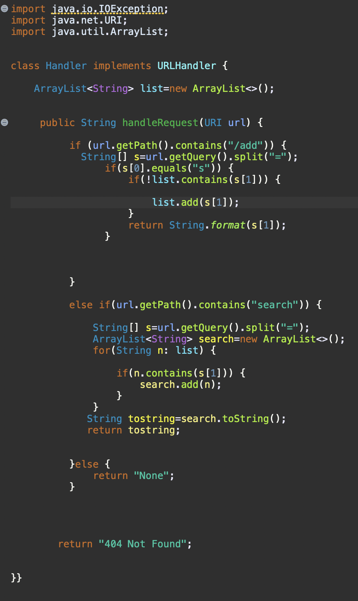
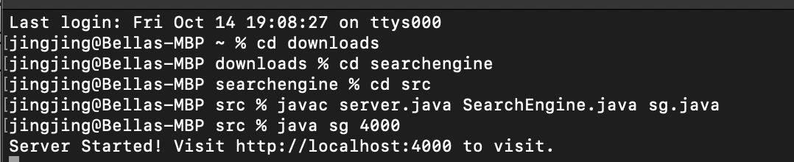
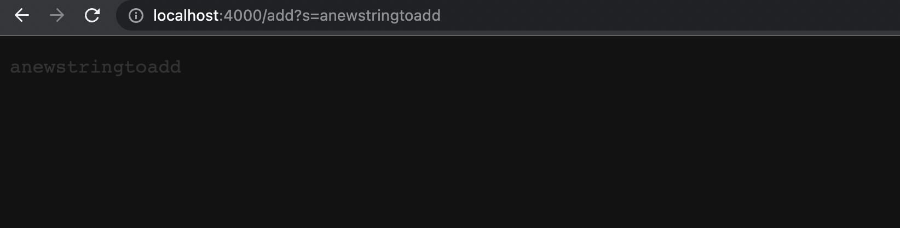
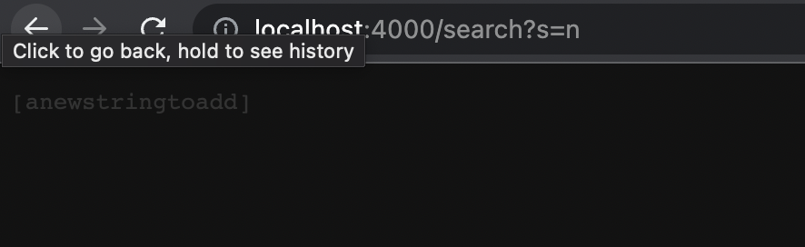
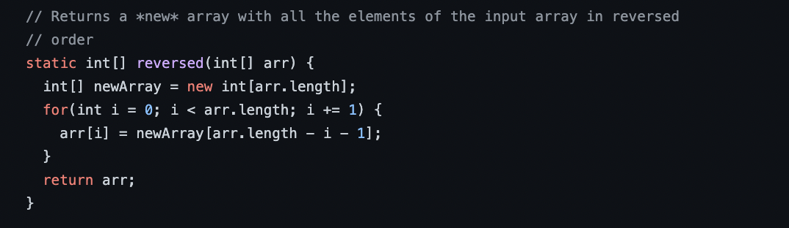
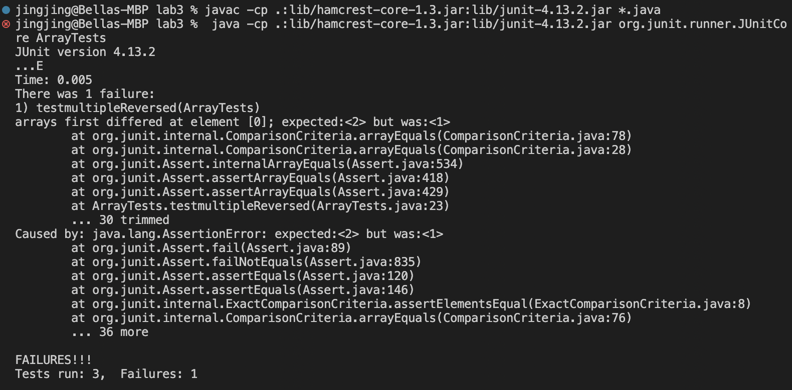
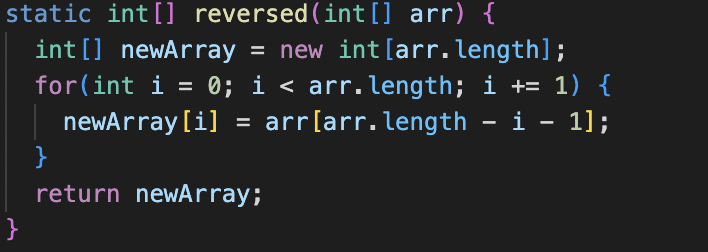
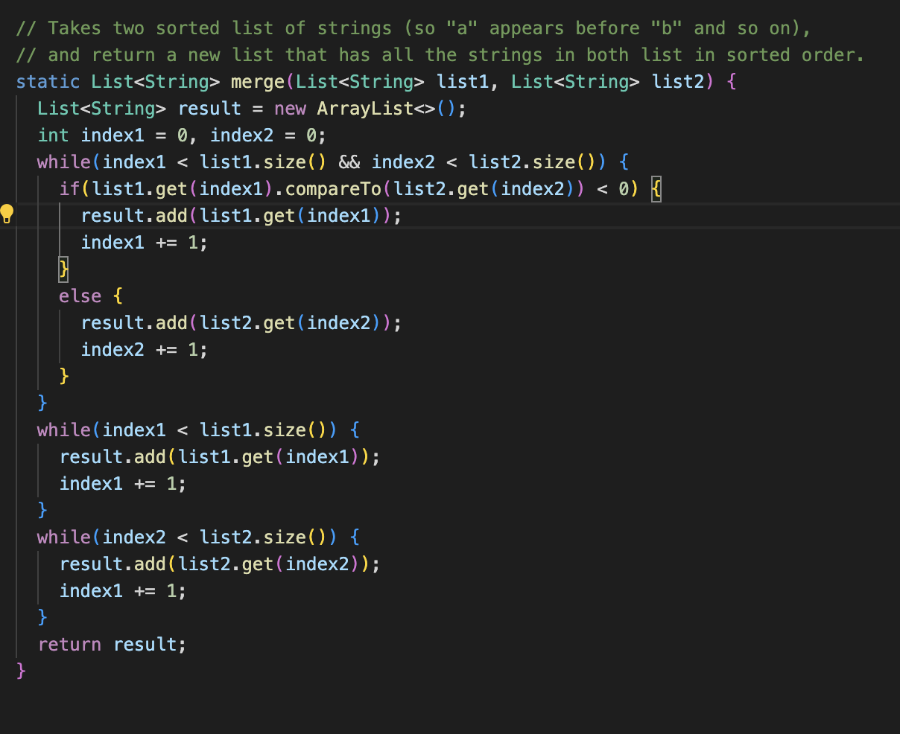
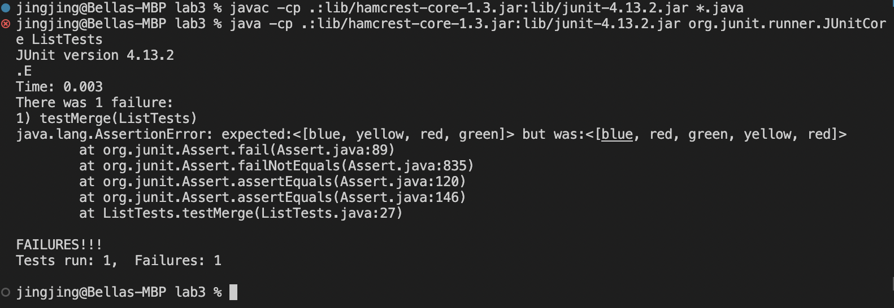
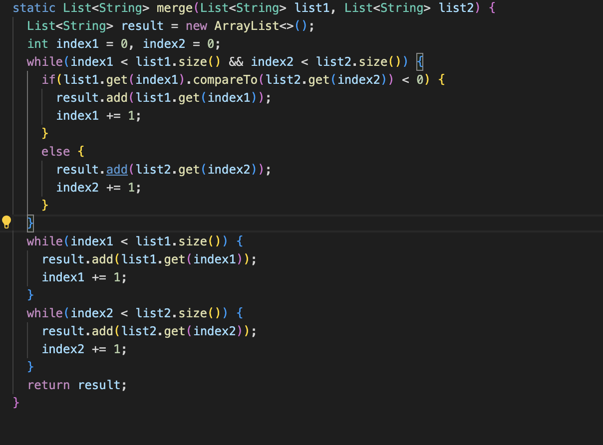

# Lab 2&3 report
Part 1

1.Code

2.Start Server

1.add method

To add new strings to the list, the method called was handleRequest(URL url) and inside the method, the requirement is defined when the url contained add key word. All the path are stored as string s. Check if the first element of s is equal to 0 && if the list does not contain the second element, the string will be added to the list. 

2.search method

To search the strings, the method called was handleRequest(URL url) and inside the method, the requirement is defined when url contained search key word. The path is still stored in s. A new arraylist is created to add the matched strings. The format of search arraylist is then converted to string. And for other url path that does not meet the requirement, "None" is returned. 

Part 2

-For Reversed methods:

1.The failure-inducing input

2.The symptom

3.The bug

4.Explain:
The original code did not return the new array. Therefore, returning the new array intead of the old one will solve the problem, which is that it return the original array.

-For Merge methods

1.The failure-inducing input 

2.The symptom

3.The bug

4.Explain

Instead of using index2 at the end of the loop, the author used index1. This cause the code to run the loop on and on which leads to the wrong result, which is repeating add the repeated strings.