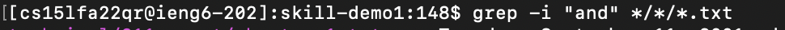
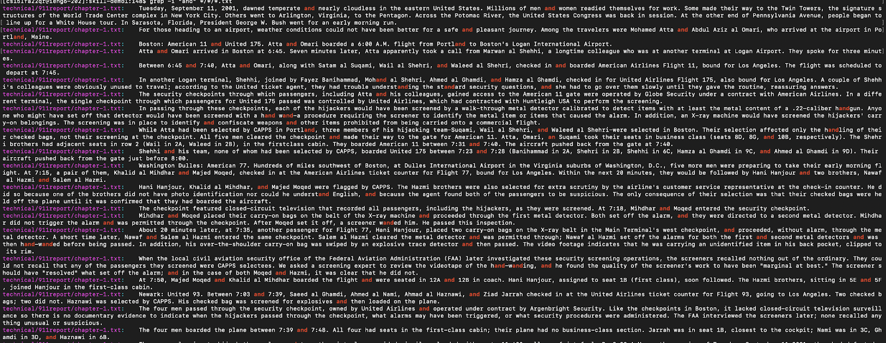
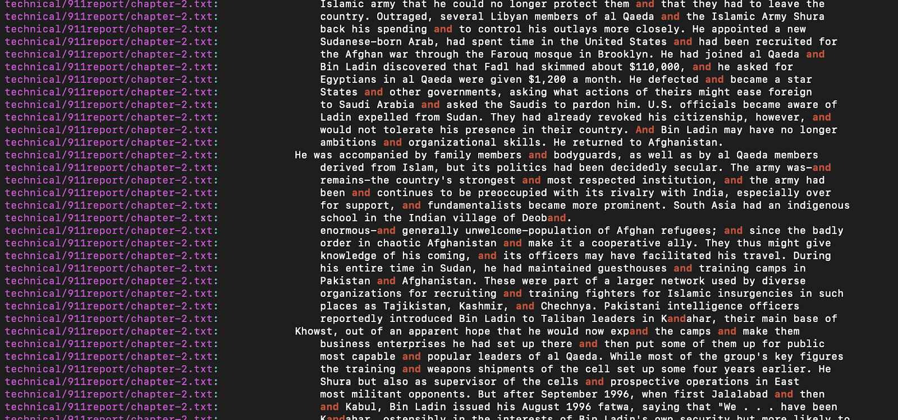
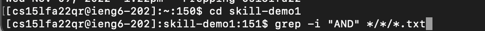
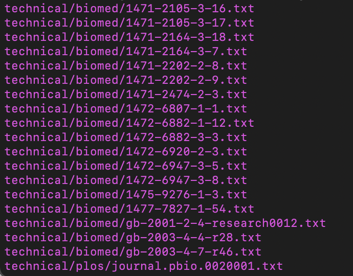
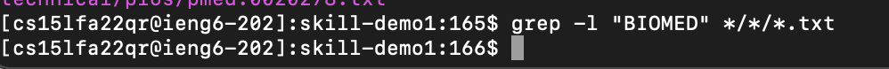

Researching Commands

Commands for grep

-First essential flag
-i
-i command return each matched places with the provided string.

First senario:
All lower cases word -> and 
The command is shown below

The results are shown below

The above two pictures show the results partially but not completely. The screenshots are for references.

