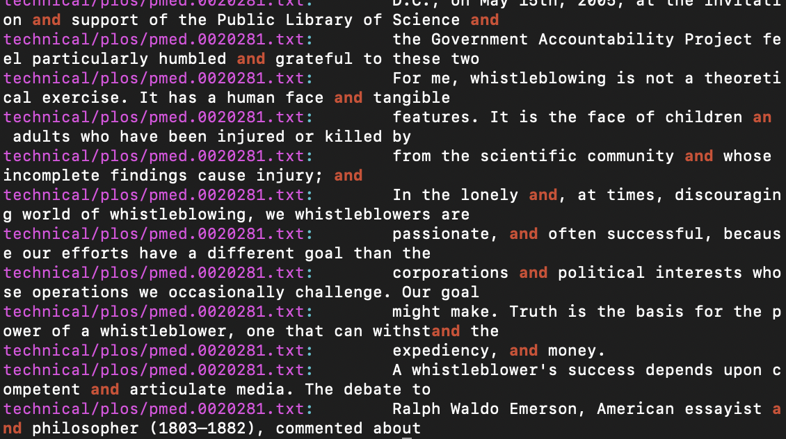
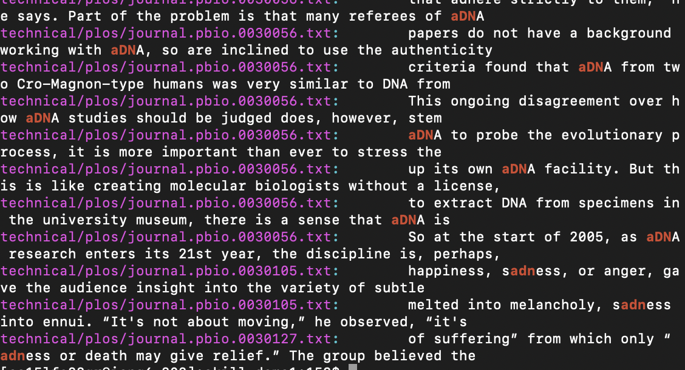
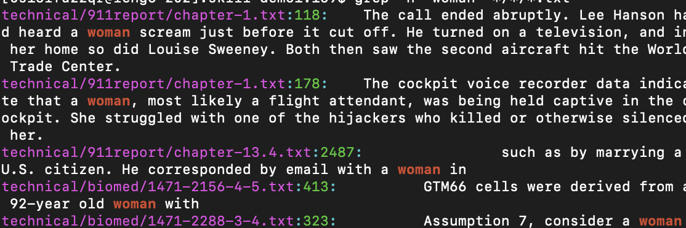
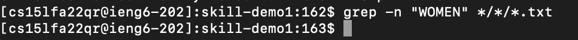
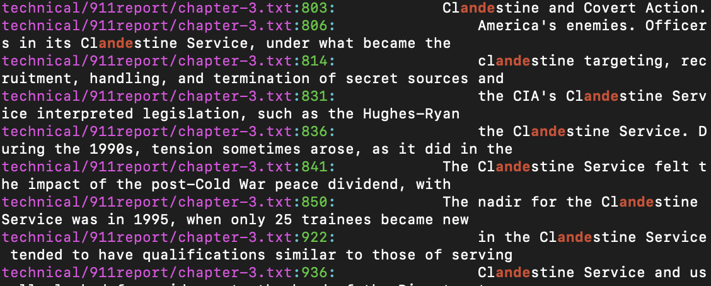
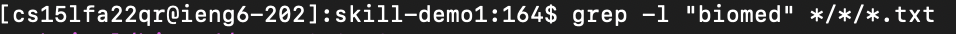
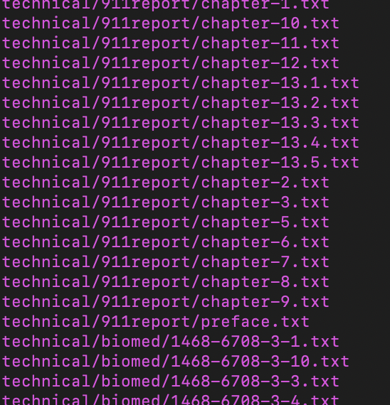

Researching Commands

Commands for grep

-First essential flag

-i

-i command return each matched places with the provided string.

First senario:
All lower cases word -> and 
The command is shown below

The results are shown below

The above two pictures show the results partially but not completely. The screenshots are for references.

Second senario:
The second example is to search the string "AND" in the given repository to test if the command is case sensitive.

The command is shown below

The above picture show the results partially. It can be seen that the command is not case sensitive. In other words, it ignores the case.

Third senario:
The third example  is to use random letters to test if the commad only work on complete words.
The command is shown below.

Partial results are shown below for reference. it is clear that the command can still work with random letters, instead of complete words.

-n

-n is used to return the given string's line number in the specific file

First Senario:

The first example is the string "woman"to test the command.
The command is shown below.

On the picture above, the command returns the line number for each corresponding string. Parital results are shown for reference.

Second Senario:

The second example is the string "WOMEN" to test the case sensitivity of the command.
The command is shown below.

As the picture above shows, the command does not return anything. That is because in all the files in the directory, there is no string "WOMEN" contained. Therefore, it can be proved that the command is case sensitivity.

Third Senario:

The third example is the string "ande" to test if the command can work on random letters instead of complete words. 

As the picture above shows, the command return all the line numbers containing string "ande" which shows that the command can work on random strings. 

-l

-l command returns only the names of files containing a valid match.

First Senario:
The first example is the string "biomed"to test the command.
The command is shown below

On the picture above, the command returns the files that match "biomed". Parital results are shown for reference.

Second Senario:
The second example is the string "BIOMED" to test the case sensitivity of the command.
The command is shown below.

As the picture above shows, the command does not return anything from the directory. That is because in all the files in the directory, there is no file name contianed "BIOMED". Therefore, it can be proved that the command is case sensitivity.

Third Senario:
The third example is to use random letters to test if the commad only work on complete words. In this case, letter "a" is used to show the result.
The command is shown below.

As the picture above shows, the command return all the file with name including letter "a" which shows that the command can work on random strings. 

