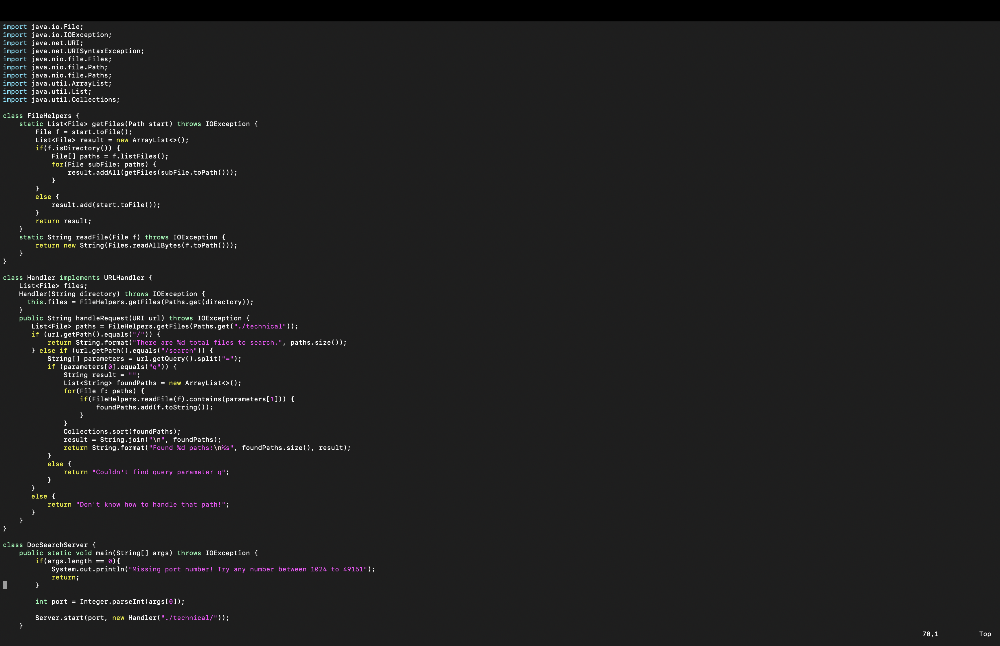
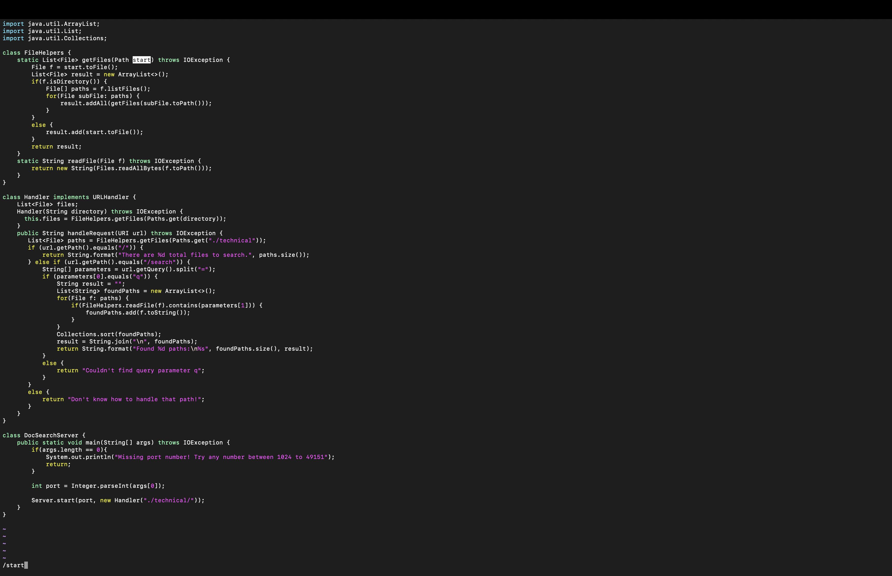
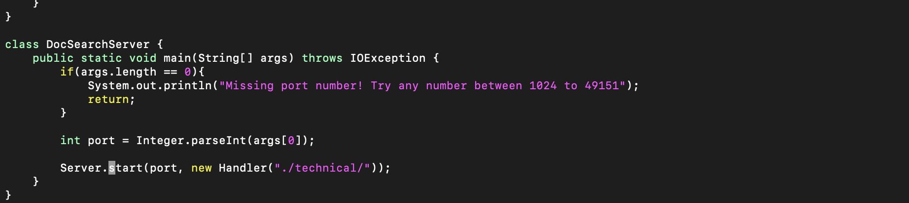
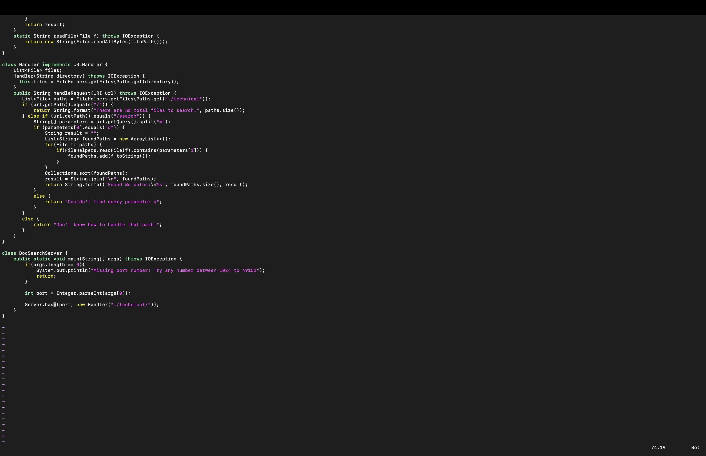
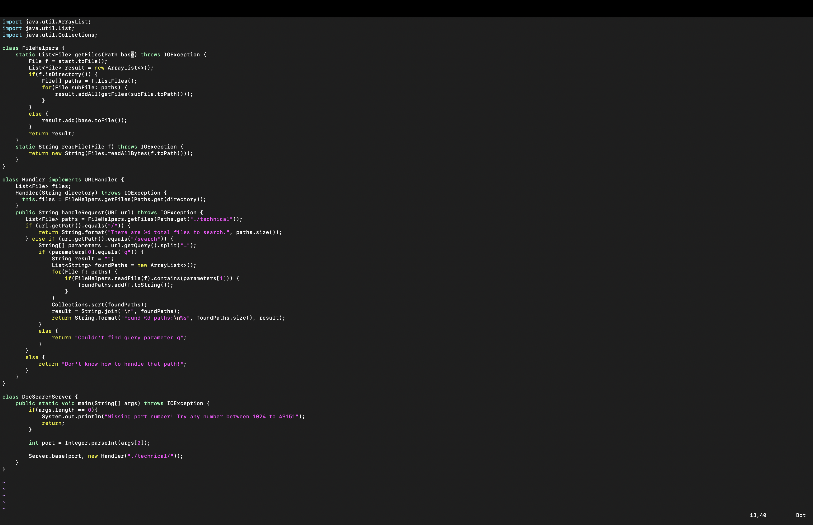

Part 1
-Changing the name of the start parameter and it uses to base.
/start<Enter>cgn base<Esc>n.n.n.:w<Enter>
-use the command vim to open the file in terminal

-/start <Enter>, which search for the string start in the file and press enter to go to the word

-Type cgn to delete the word and enter base to replace

 
-Type n. to move to next targeted word and replace with the same word you typed before. Repeat this process until no targeted words left.

-Save all the work using :w then press enter to save.

Part 2
-scp time:48 seconds
-vim time:25 seconds

Question:

Which of these two styles would you prefer using if you had to work on a program that you were running remotely, and why?

Answer:

I would use scp for now because vim's operation and command still needs to be practiced before really using it in a program. If I miss one step or did one step wrong vim might be difficult to change.

Question:

What about the projector task might factor into your decision one way or another?

Answer:

Time to do the operation is one thing that I will be thinking. If the project needs super fast operation time, then I will choose one way to finish. Another factor that might influence might be the file numbers and size that are needed. Because sending files with huge sizes will take more time. 